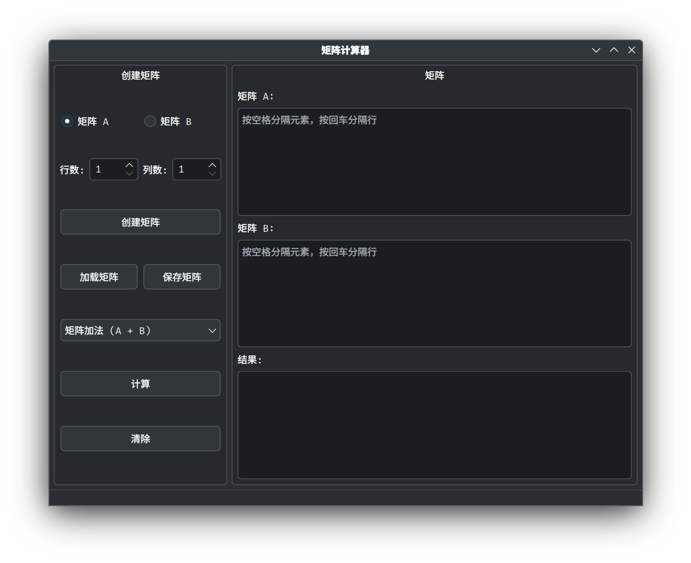
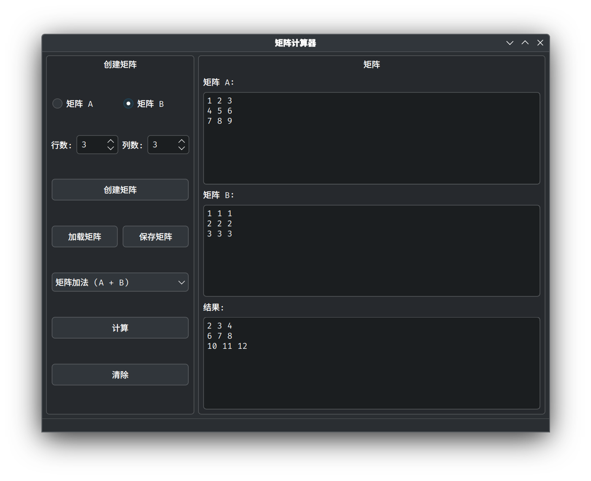
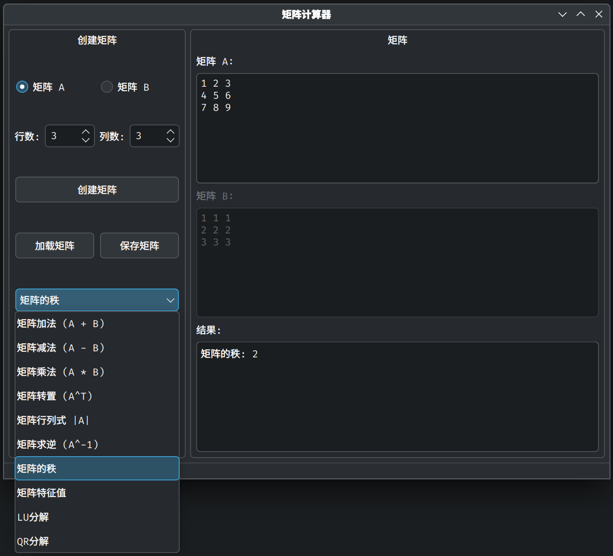

# Matrix-Calculator

## 项目简介

这是一个基于Qt6开发的矩阵计算器，旨在提供一个简单易用的图形界面，用于进行各种矩阵运算。该项目使用C++类模板实现了矩阵数据结构，可以灵活处理不同数据类型的矩阵运算。

## 功能特性

目前实现的矩阵操作包括：

- 基本运算：矩阵加法、减法、乘法
- 矩阵变换：矩阵转置
- 矩阵特性计算：行列式、矩阵的秩
- 矩阵分解：LU分解、QR分解
- 高级计算：矩阵求逆、特征值计算
- 辅助功能：矩阵的创建、保存与加载

## 技术实现

- 使用Qt6框架构建图形用户界面
- 采用C++类模板设计矩阵数据结构，支持不同数据类型
- 使用面向对象编程思想，将矩阵操作封装为独立的类
- 实现了多种矩阵算法，如高斯消元法、幂方法等

## 系统要求

- Qt 6.0或更高版本
- C++17兼容的编译器

## 编译与运行

1. 确保您已安装Qt6开发环境
2. 使用QtCreator打开Matrix-Calculator.pro项目文件
3. 配置构建环境
4. 点击构建并运行项目

## 使用说明

1. 创建矩阵：
   - 选择矩阵A或矩阵B
   - 设置行数和列数
   - 点击"创建矩阵"按钮
   - 在文本框中编辑矩阵元素（按空格分隔元素，按回车分隔行）

2. 执行计算：
   - 从下拉菜单中选择需要执行的矩阵操作
   - 点击"计算"按钮
   - 在结果区域查看计算结果

3. 保存/加载矩阵：
   - 点击"保存矩阵"可将当前选中的矩阵保存到文本文件
   - 点击"加载矩阵"可从文本文件中加载矩阵数据

## 项目结构

- `matrix.h`: 矩阵类模板的实现
- `matrixoperation.h`: 矩阵运算的实现
- `mainwindow.h/cpp`: GUI界面的实现
- `main.cpp`: 程序入口点

## 局限性及待改进

当前版本存在一些局限性：

- 特征值计算仅实现了简化版本，对于大型矩阵可能不够精确
- 某些高级矩阵分解算法的数值稳定性可能需要进一步优化
- 界面设计较为简单，可以进一步美化和优化用户体验
